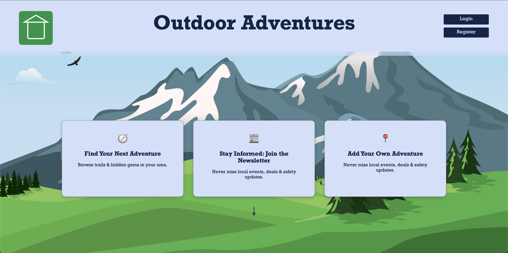
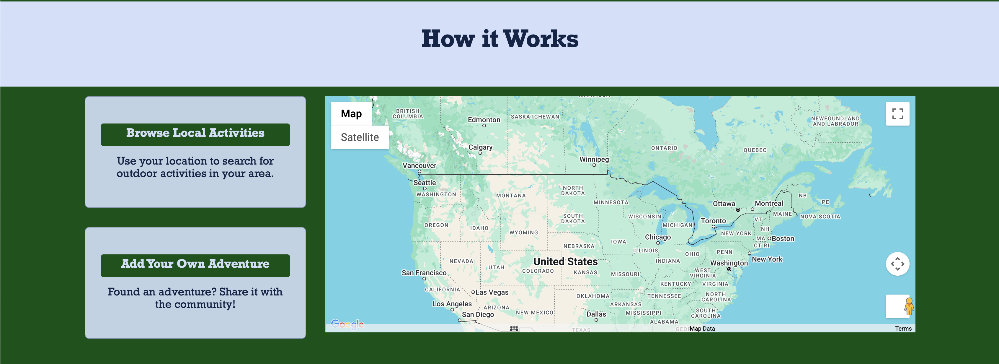
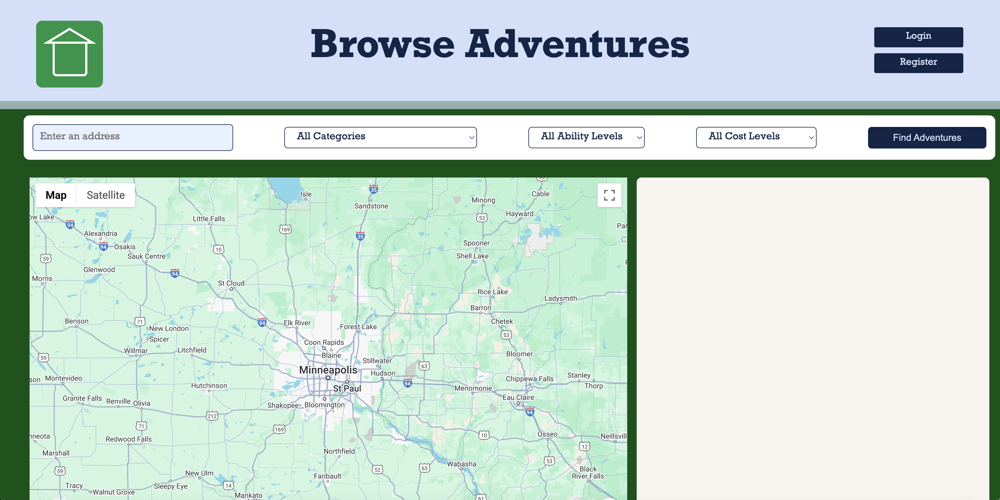
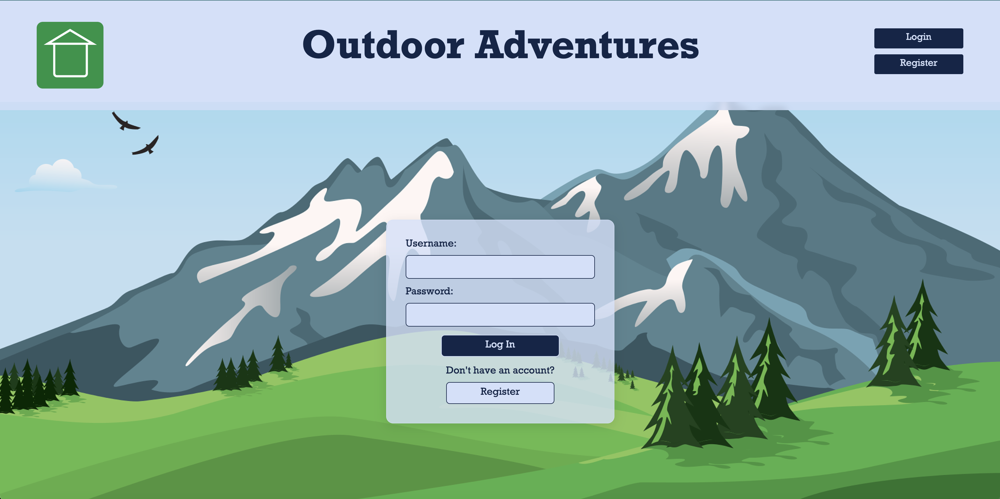
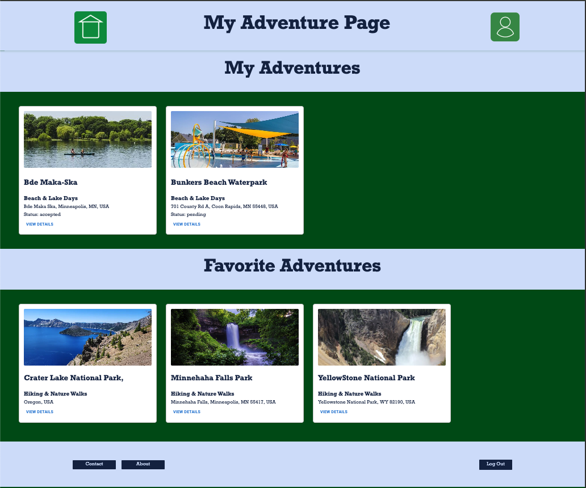
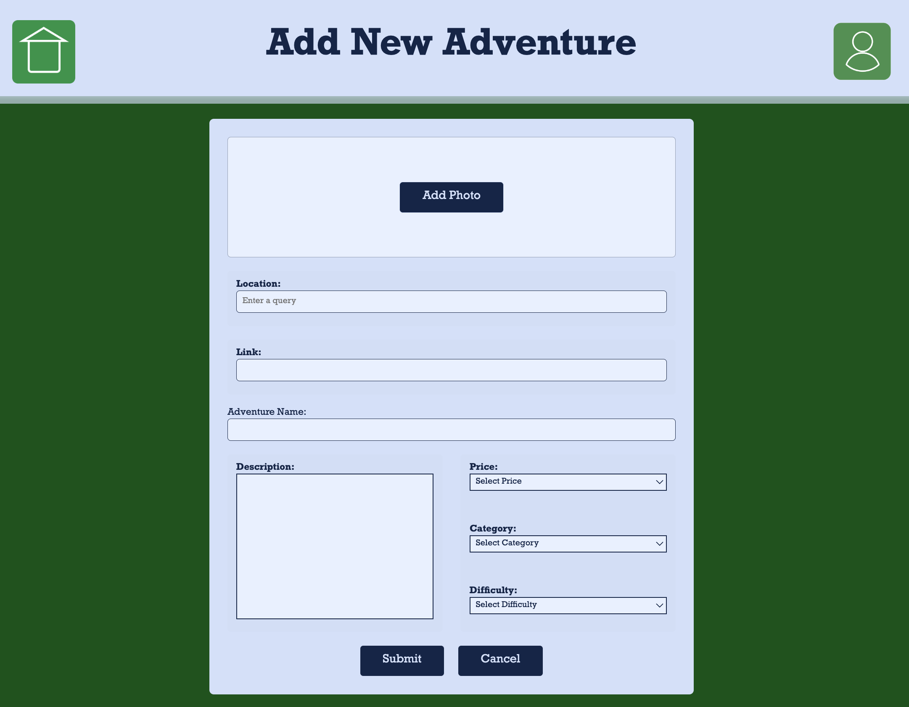
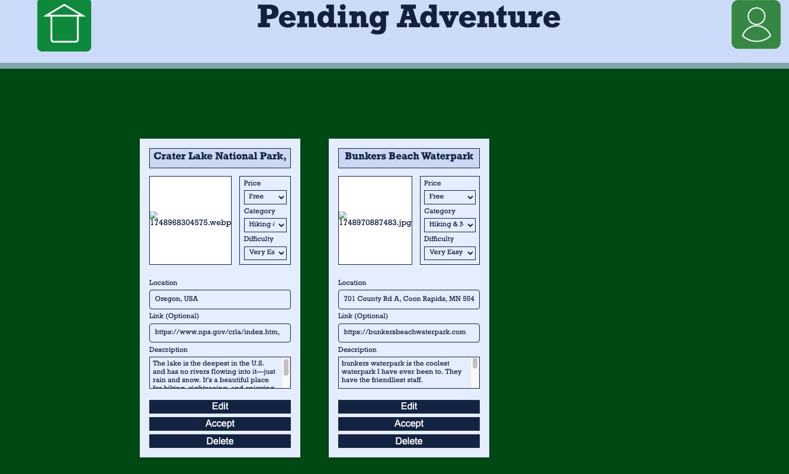

# Outdoor Adventures

## Description
Outdoor Adventures is a community based app centered on getting families out into nature and discovering the world around them. In a world often centered around technology, starting a journey of connecting with the outdoors can be overwhelming, especially for those who don't yet have expereince doing so. Outdoor Adventures brings together exciting activites such as hiking, camping, paddling, and many more. All can be found on one site, easily accesable for soon to be adventurers of all experience levels. Once adventures are found, they can be added by the community for all to enjoy.

## Built With:
This version uses React, Zustand, Express, Passport, and PostgreSQL. (A full list of dependencies can be found in `package.json`.)

## Prerequisites

Before you get started, make sure you have the following software installed on your computer:

- [Node.js](https://nodejs.org/en)
- [PostgreSQL](https://www.postgresql.org)
- [Nodemon](https://nodemon.io)

## Create Database and User Table

Create a new database named "outdoor-adventures", then create a `user` table using the query found in `database.sql` as well as the other tables available in the `database.sql`.

## Initial Setup Instructions

- In this repo's **root directory**, run `npm install`.
- Create an `.env` file in the **root directory**, then paste this line into the file:
- Run `npm run server` to start the server.
- Run `npm run client` to start the client.
- Navigate to `localhost:5173`.

## Lay of the Land

### The Home Page

To start, users are greeted by the Outdoor Adventures' home page. Right away they have the opportunity to find their next adventure, join the newsletter for community updates, or add their own adventure.

A quick scroll on the home page will also give a tutorial on how to use Outdoor Adventures with an interactive map.

### Browse Adventures Page

Once a user is ready to find their next adventure, they can navigate to the "Browse Adventures" page. At the top of the page's contents, users can input their location, select and adventure category, and filter by ability level and price. Once the "Find Adventures" button is clicked, the right-hand column will populate adventures within a 20 mile radius for users to select from. The map will also populate with pinpoints.

### Login Page

If a user would like to save their adventures or add their own, they will first need to login. Don't have a login? No problem, they can also register for an account!

### User Page

Once a user is logged in an ready to go, they can check out their user page. This will show a list of all the adventures they submitted (with a status on whether or not it has been accepted or is pending review) to the site as well as adventures they favorited for the future.

### Add Adventure Form

When logged in, users can add their own adventures for the whole community to enjoy. The Add Adventure Form allows them to upload a photo, include a link and title, describe their adventure, and choose the appropriate categories from the drop down menues.

### Admin Page

With so many exciting adventures being added, an admin can make sure Outdoor Adventures stays on target. From the admin's page they can view all the submitted adventures. They have the ability to accept, edit, or decline any new adventures. If a submission is accepted, it will be available for all to enjoy on Outdoor Adventures.

